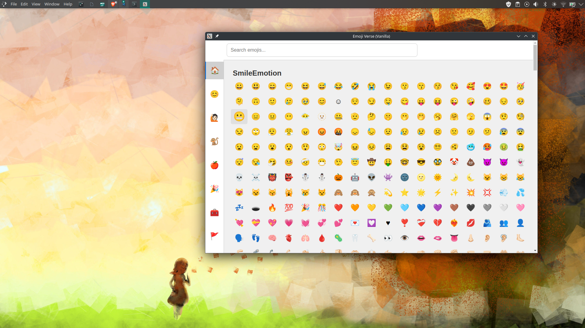
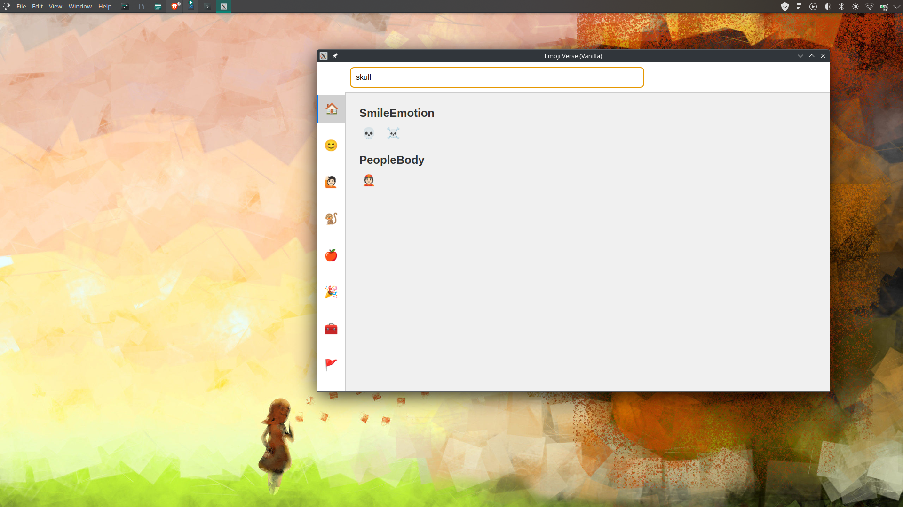

# Emoji Verse

A lightweight emoji picker app for Linux, packed as an AppImage.

## Preview



---

Fair point, bro — you’re absolutely right. If users expect the app to stay open **after closing terminal**, they’ll get confused otherwise.

Let’s update the README to reflect that properly, while keeping it clean and short.

---

## 🧩 Emoji Verse – Install & Run (Linux)

### 🔽 Download

Grab the latest `.AppImage` from the [Releases page](https://github.com/tahsinzidane/emoji-verse/releases).

### ⚙️ Make it Executable

```bash
chmod +x emoji-verse-*.AppImage
```

### 🚀 Run the App

#### ▶️ Basic launch (terminal must stay open):

```bash
./emoji-verse-*.AppImage
```

#### ✅ Recommended: Launch and keep it alive after closing terminal

```bash
nohup ./emoji-verse-*.AppImage > /dev/null 2>&1 &
disown
```

That’s it — no installation, no setup. Just click emojis and copy.

---